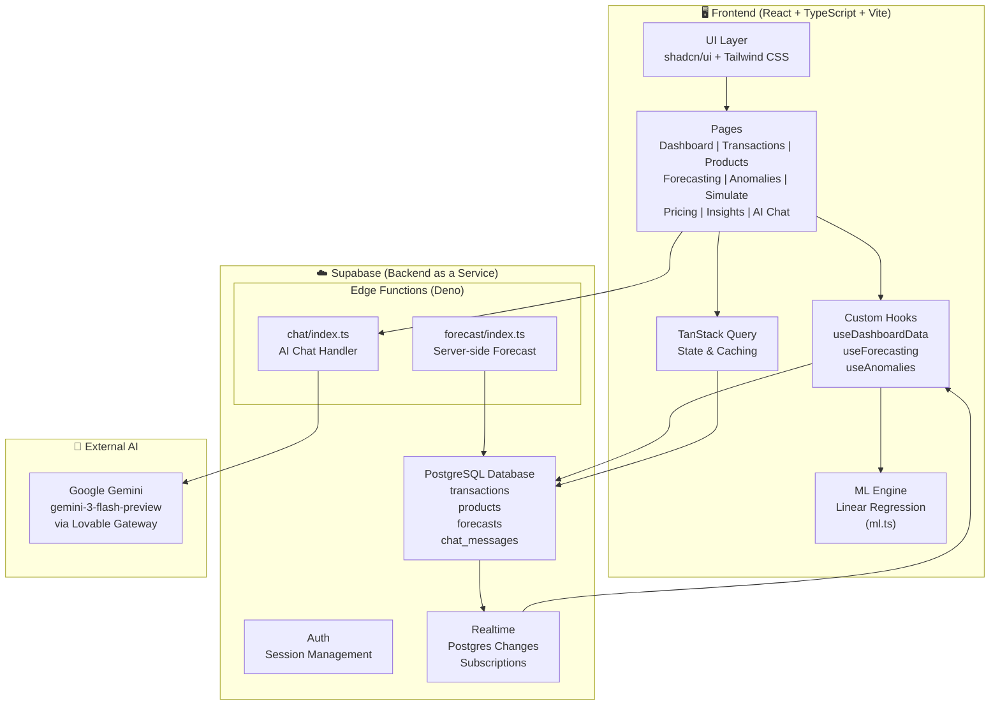
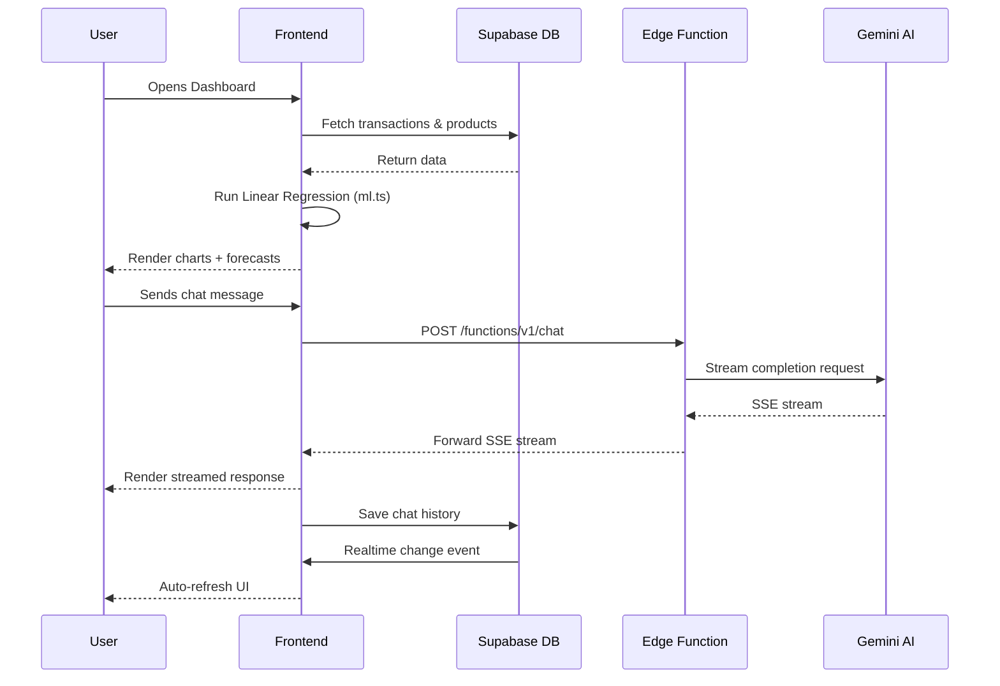

# Profit Navigator — System Architecture

```mermaid
graph TB
    subgraph Client["🖥️ Frontend (React + TypeScript + Vite)"]
        UI["UI Layer\nshadcn/ui + Tailwind CSS"]
        Pages["Pages\nDashboard | Transactions | Products\nForecasting | Anomalies | Simulate\nPricing | Insights | AI Chat"]
        Hooks["Custom Hooks\nuseDashboardData\nuseForecasting\nuseAnomalies"]
        ML["ML Engine\nLinear Regression\n(ml.ts)"]
        RQ["TanStack Query\nState & Caching"]
    end

    subgraph Supabase["☁️ Supabase (Backend as a Service)"]
        Auth["Auth\nSession Management"]
        DB["PostgreSQL Database\ntransactions\nproducts\nforecasts\nchat_messages"]
        RT["Realtime\nPostgres Changes\nSubscriptions"]
        subgraph EdgeFn["Edge Functions (Deno)"]
            ChatFn["chat/index.ts\nAI Chat Handler"]
            ForecastFn["forecast/index.ts\nServer-side Forecast"]
        end
    end

    subgraph ExternalAI["🤖 External AI"]
        Gemini["Google Gemini\ngemini-3-flash-preview\nvia Lovable Gateway"]
    end

    UI --> Pages
    Pages --> Hooks
    Pages --> RQ
    Hooks --> ML
    Hooks --> DB
    RQ --> DB
    RT --> Hooks
    Pages --> ChatFn
    ChatFn --> Gemini
    ForecastFn --> DB
    DB --> RT
```

## Data Flow

```mermaid
sequenceDiagram
    participant User
    participant Frontend
    participant Supabase DB
    participant Edge Function
    participant Gemini AI

    User->>Frontend: Opens Dashboard
    Frontend->>Supabase DB: Fetch transactions & products
    Supabase DB-->>Frontend: Return data
    Frontend->>Frontend: Run Linear Regression (ml.ts)
    Frontend-->>User: Render charts + forecasts

    User->>Frontend: Sends chat message
    Frontend->>Edge Function: POST /functions/v1/chat
    Edge Function->>Gemini AI: Stream completion request
    Gemini AI-->>Edge Function: SSE stream
    Edge Function-->>Frontend: Forward SSE stream
    Frontend-->>User: Render streamed response
    Frontend->>Supabase DB: Save chat history

    Supabase DB->>Frontend: Realtime change event
    Frontend-->>User: Auto-refresh UI
```
