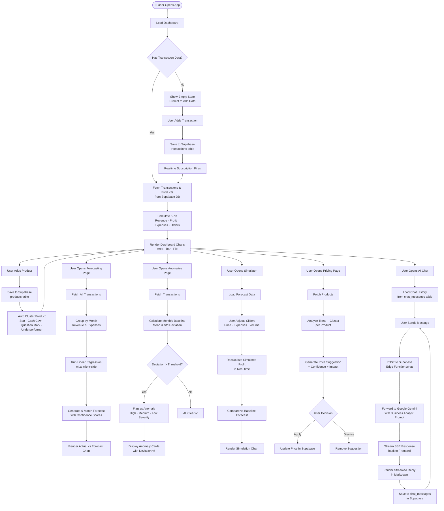

# Profit Navigator — System Flow Diagram

```mermaid
flowchart TD
    A([👤 User Opens App]) --> B[Load Dashboard]

    B --> C{Has Transaction Data?}

    C -- No --> D[Show Empty State\nPrompt to Add Data]
    C -- Yes --> E[Fetch Transactions & Products\nfrom Supabase DB]

    E --> F[Calculate KPIs\nRevenue · Profit · Expenses · Orders]
    F --> G[Render Dashboard Charts\nArea · Bar · Pie]

    %% Transaction Flow
    D --> H[User Adds Transaction]
    H --> I[Save to Supabase\ntransactions table]
    I --> J[Realtime Subscription Fires]
    J --> E

    %% Product Flow
    G --> K[User Adds Product]
    K --> L[Save to Supabase\nproducts table]
    L --> M[Auto Cluster Product\nStar · Cash Cow · Question Mark · Underperformer]
    M --> G

    %% Forecasting Flow
    G --> N[User Opens Forecasting Page]
    N --> O[Fetch All Transactions]
    O --> P[Group by Month\nRevenue & Expenses]
    P --> Q[Run Linear Regression\nml.ts client-side]
    Q --> R[Generate 6-Month Forecast\nwith Confidence Scores]
    R --> S[Render Actual vs Forecast Chart]

    %% Anomaly Detection Flow
    G --> T[User Opens Anomalies Page]
    T --> U[Fetch Transactions]
    U --> V[Calculate Monthly Baseline\nMean & Std Deviation]
    V --> W{Deviation > Threshold?}
    W -- Yes --> X[Flag as Anomaly\nHigh · Medium · Low Severity]
    W -- No --> Y[All Clear ✅]
    X --> Z[Display Anomaly Cards\nwith Deviation %]

    %% Simulator Flow
    G --> AA[User Opens Simulator]
    AA --> AB[Load Forecast Data]
    AB --> AC[User Adjusts Sliders\nPrice · Expenses · Volume]
    AC --> AD[Recalculate Simulated Profit\nin Real-time]
    AD --> AE[Compare vs Baseline Forecast]
    AE --> AF[Render Simulation Chart]

    %% Pricing Engine Flow
    G --> AG[User Opens Pricing Page]
    AG --> AH[Fetch Products]
    AH --> AI[Analyze Trend + Cluster\nper Product]
    AI --> AJ[Generate Price Suggestion\n+ Confidence + Impact]
    AJ --> AK{User Decision}
    AK -- Apply --> AL[Update Price in Supabase]
    AK -- Dismiss --> AM[Remove Suggestion]

    %% AI Chat Flow
    G --> AN[User Opens AI Chat]
    AN --> AO[Load Chat History\nfrom chat_messages table]
    AO --> AP[User Sends Message]
    AP --> AQ[POST to Supabase\nEdge Function /chat]
    AQ --> AR[Forward to Google Gemini\nwith Business Analyst Prompt]
    AR --> AS[Stream SSE Response\nback to Frontend]
    AS --> AT[Render Streamed Reply\nin Markdown]
    AT --> AU[Save to chat_messages\nin Supabase]
    AU --> AP
```
